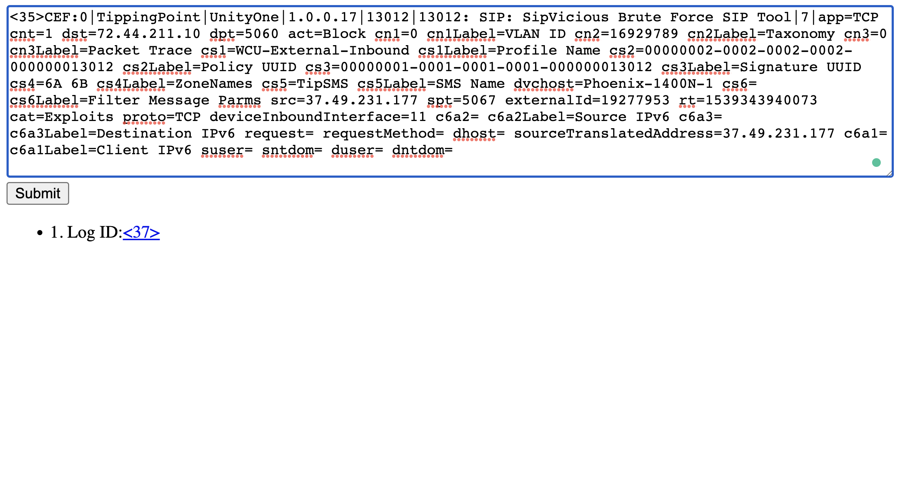
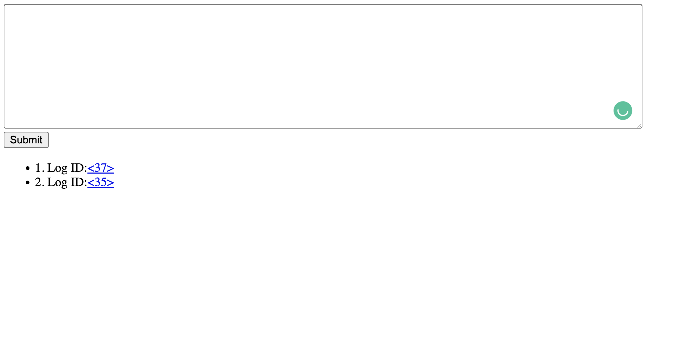
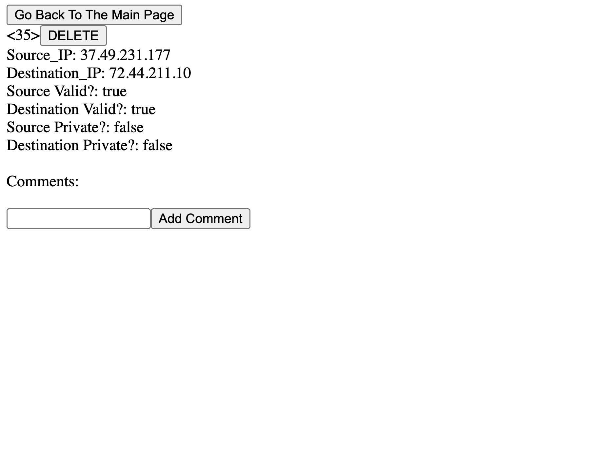
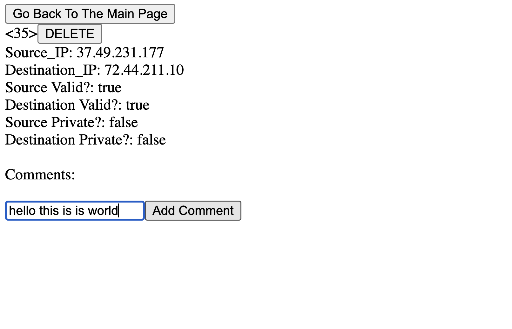
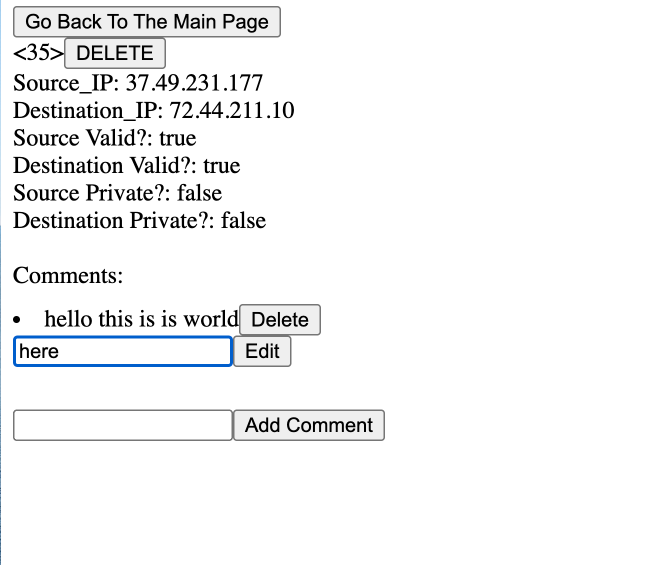

# Bamazon
## Live link - [Demo Vid Click Here](https://drive.google.com/file/d/1IT8S7yATQDZ5ob-fbtBLdTs6E4ZwE2Gq/view?usp=sharing)

This project demost

Background:
Valid IP Addresss:
Class A or large networks: 001.0.0.001 to 126.254.254.254
Class B or medium sized networks: 128.1.0.1 to 191.254.254.254
Class C or small networks: 192.0.1.1 to 223.254.254.254

Class A or large networks: 001.0.0.001 to 126.254.254.254
Class B or medium sized networks: 128.1.0.1 to 191.254.254.254
Class C or small networks: 192.0.1.1 to 223.254.254.254

Private IP Address

### Technology Used
* Backend Structure
    * The project's backend was built from a Rails framework and utilizes Ruby, jbuilder and jquery to communicate with our frontend
* Frontend Structure
    * The project's frontend was built from a React framework utilizing the React library heavily relying on Javascript for functionality and CSS to bring the site to life

## Features

* createLog: parse the string log into the form and import information(source_IP
and destination_IP). Perfrom algrithm to check if its valid IP and or private

* Index Page: List all parsed logs  

* Event Show Page: Show the detail of each log(you can comment of each log here)

* deleteEvent: remove parsed event from the database

* createComment: add comment to each log

* Index Comments: list all the commments 

* Update amd Delete Comment: update and delete the comment from the database

